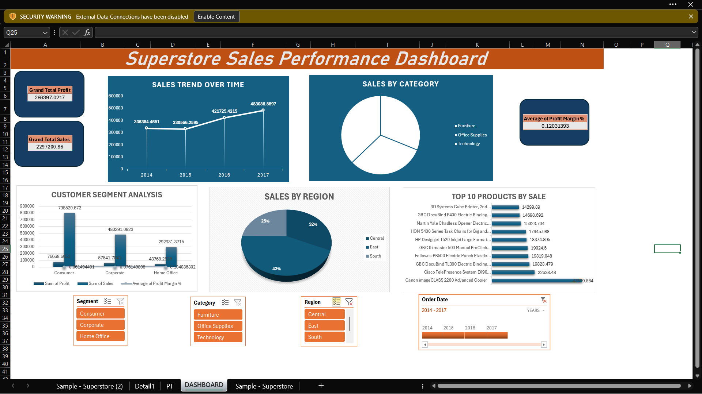

# Superstore Sales Performance Dashboard 📊

## 📝 Project Overview
This project features an interactive Excel dashboard designed to analyze retail performance data from **2014 to 2017**. By transforming raw transactional data into visual insights, the dashboard tracks profitability, sales growth, and regional performance to support data-driven business decisions.

---

## 🛠️ Technical Features

### **Data Analysis**
* **Pivot Tables & Advanced Formulas:** Leveraged to calculate core KPIs, including:
    * **Grand Total Profit:** 286,397
    * **Total Sales Volume:** 2.29M
* **Data Cleaning:** Processed raw transactional records for accuracy and consistency.

### **Interactive UI**
* **Dynamic Filtering:** Implemented **Slicers** (Segment, Category, Region) to allow users to drill down into specific data points.
* **Temporal Control:** Integrated a **Timeline** (Order Date) for easy year-over-year or month-over-month comparisons.

### **Data Visualization**
* **Line Charts:** Used for time-series trend analysis.
* **Donut & Pie Charts:** Leveraged for categorical and regional distribution.
* **Bar Charts:** Utilized for ranking top-performing products and sub-categories.

---

## 📈 Key Insights

| Metric | Insight |
| :--- | :--- |
| **Growth Trend** | Sales show a consistent upward trajectory, peaking in 2017 at over **483,000**. |
| **Regional Dominance** | The **West** region leads with **32%** of total sales, followed by the East. |
| **Customer Segments** | The **Consumer** segment is the primary driver, generating nearly **800,000** in sales. |
| **Top Product** | The *Canon imageCLASS 2200 Advanced Copier* is the highest-selling individual item. |
| **Profitability** | Maintained an average profit margin of approximately **12%** across all categories. |

---

## 🚀 How to Use
1.  Download the `.xlsx` file from this repository.
2.  Open in Microsoft Excel (2016 or later recommended).
3.  Use the **Slicers** on the right/top to filter by Region or Category.
4.  Adjust the **Timeline** to view specific performance windows between 2014-2017.

---  

