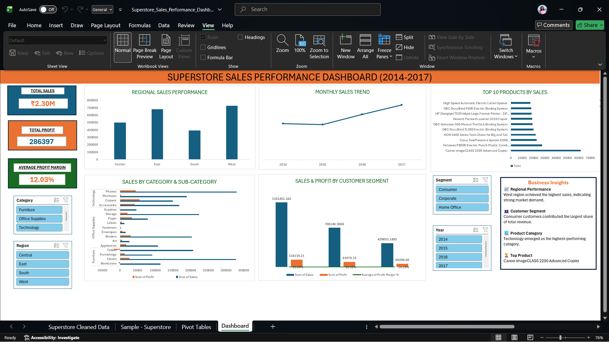

# 📊 Superstore Sales Performance Dashboard (2014–2017)

## 📌 Project Overview

This project presents an interactive Excel dashboard built using the Superstore Sales dataset. The dashboard analyzes sales, profit, customer segments, product categories, and regional performance to provide actionable business insights. It enables users to explore data dynamically through interactive filters and KPIs.

---

## 🎯 Objective

To analyze retail sales data and develop an interactive Excel dashboard that helps stakeholders monitor business performance, identify trends, and support data-driven decision-making.

---

## 🛠️ Tools & Technologies

- Microsoft Excel
- Pivot Tables
- Pivot Charts
- Slicers
- Timeline
- Data Cleaning
- KPI Cards
- Data Visualization

---

## 📊 Dashboard KPIs

- 💰 Total Sales
- 💵 Total Profit
- 📈 Average Profit Margin

---

## 📉 Dashboard Visualizations

- Monthly Sales Trend
- Regional Sales Performance
- Sales by Category & Sub-Category
- Sales & Profit by Customer Segment
- Top 10 Products by Sales

---

## 🎛️ Interactive Filters

The dashboard includes interactive filters for:

- Category
- Region
- Segment
- Year

These slicers dynamically update all charts and KPI cards.

---

## 📌 Business Insights

- West region recorded the highest sales among all regions.
- Consumer segment contributed the largest share of total sales.
- Technology emerged as the highest-performing product category.
- Canon imageCLASS 2200 Advanced Copier was the highest-selling product.
- Sales showed consistent growth during the analyzed period.

---

## ▶️ How to Use

1. Download or clone this repository.
2. Open **Superstore_Sales_Performance_Dashboard.xlsx** using Microsoft Excel (Excel 2019, Excel 2021, Excel 2024, or Microsoft 365).
3. Click **Enable Editing** if prompted.
4. Open the **Dashboard** worksheet.
5. Use the slicers to filter the dashboard by:
   - Category
   - Region
   - Segment
   - Year
6. The KPI cards and charts will update automatically based on the selected filters.
7. Click the **Clear Filter** icon on any slicer to reset the dashboard.

---

## 📂 Project Structure

```
Superstore-Sales-Dashboard/
│── Superstore_Sales_Performance_Dashboard.xlsx
│── dashboard.png
│── Sample-Superstore.csv
│── README.md
```

---

## 🖼️ Dashboard Preview



---

## 🚀 Skills Demonstrated

- Data Cleaning
- Data Analysis
- Business Intelligence
- Dashboard Design
- KPI Reporting
- Data Visualization
- Microsoft Excel
- Pivot Tables
- Pivot Charts
- Slicers & Timeline
- Business Insights Generation

---

## 🚀 Future Improvements

- Integrate Power Query for automated data preparation.
- Add KPIs such as Total Orders and Average Order Value.
- Recreate the dashboard in Power BI for enhanced visualization.
- Connect to a live database for automatic data refresh.

---

## 📚 Dataset

**Source:** Superstore Sales Dataset (Kaggle)

---

## 👩‍💻 Author

**Khushi Yadav**

Aspiring Data Analyst

**Skills:** Excel | SQL | Python | Power BI
